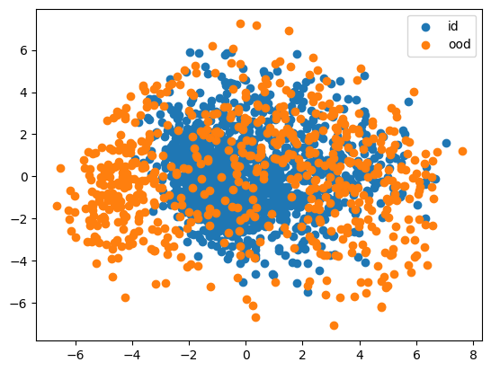
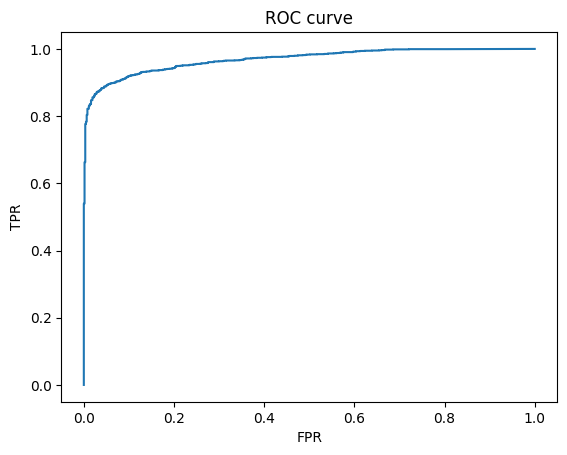

# Detect Out-Of-Distribution samples

## Stage 1
Generate **Out-Of-Distribution** for selected model according Euclidean-norm and Mahalanobis distance. 
To shift samples from the distribution use an **adversarial attack**. 

## Stage 2
To obtain a degree of confidence that the data are in the original distribution, a modification of the original model is used. 
The modified model returns an embedding vector and In-Distribution probability. 
To find the ID probability the Mahalanobis distance is used. 
|  |
|:--:|
| *ROC curve with OOD predictions* |